<div align="center">

<picture>
  <source media="(prefers-color-scheme: dark)" srcset="./assets/dark.svg">
  <source media="(prefers-color-scheme: light)" srcset="./assets/light.svg">
  
</picture>

### `SUDHEER.SEC` ΓÇö Cybersecurity ΓÇó SOC ΓÇó DFIR ΓÇó Security Research

[](https://sudheer-infosec.github.io/sudheer-portfolio-website/)
[](https://www.linkedin.com/in/singuru-sudheer-b4916b345)
[](https://github.com/sudheer-infosec)

</div>

---

## `01 / IDENTITY`

I'm **Singuru Sudheer**, a **B.Sc. Computer Science** student building practical cybersecurity capability through hands-on labs, investigation workflows, and security research.

My focus:

- 🛡️ Security Operations & SOC workflows
- 📡 SIEM, log analysis & threat detection
- 🚨 Incident response & alert triage
- 🔎 Digital forensics & evidence analysis
- 🧪 Ethical hacking & vulnerability assessment
- 🌐 Network security & traffic analysis
- 🧬 Malware-analysis learning labs
- 📝 Security documentation, tooling & research

> **Learn → Practice → Build → Document → Improve**

---

## `02 / CYBERSECURITY STACK`

| Area | Tools / Technologies |
|---|---|
| **SOC / SIEM** | Wazuh ΓÇó Splunk ΓÇó SIEM workflows ΓÇó Log Analysis |
| **Network Security** | Wireshark ΓÇó Nmap ΓÇó Suricata ΓÇó TCP/IP |
| **DFIR** | Volatility 3 ΓÇó Timesketch ΓÇó Autopsy ΓÇó Digital Evidence Workflows |
| **Detection / Malware** | Sysmon ΓÇó YARA ΓÇó IOC analysis ΓÇó Detection engineering |
| **Offensive Security** | Kali Linux ΓÇó Burp Suite ΓÇó Metasploit ΓÇó Ethical Hacking Labs |
| **Systems** | Linux ΓÇó Windows ΓÇó PowerShell |
| **Development** | Python ΓÇó HTML ΓÇó CSS ΓÇó JavaScript ΓÇó Git/GitHub |
| **Research** | Threat Detection ΓÇó Incident Response ΓÇó Cyber Investigation |

---

## `03 / OPERATIONS ΓÇö HANDS-ON LABS`

### 🛰️ Wazuh SOC Detection Lab
A practical SOC environment covering endpoint telemetry, network visibility and security-event investigation.

**Lab stack:** Wazuh Server ΓÇó Amazon Linux 2023 ΓÇó Ubuntu + Suricata ΓÇó Windows Server + Sysmon ΓÇó Kali Linux

**Detection focus:** SSH authentication events ΓÇó sudo activity ΓÇó critical-file monitoring ΓÇó PowerShell activity ΓÇó alert investigation

### 🧬 Zeus Malware Hunt Lab
Educational malware-analysis workflow focused on controlled samples, indicators, behavioral observations and investigation documentation.

### 🔎 Digital Forensics Investigation Lab
Hands-on practice with evidence acquisition concepts, artifact analysis, timeline reconstruction and forensic reporting.

### 📱 Mobile / Android Forensics
Educational investigation workflows for mobile artifacts, application data and evidence interpretation.

### 🧰 Cyber Intelligence Toolkit
A collection of defensive investigation utilities and workflows for structured cybersecurity research.

> All projects are intended for **authorized, educational, defensive and research purposes**.

---

## `04 / RESEARCH & BUILD`

```text
Observe → Collect evidence → Analyze → Detect → Investigate → Document → Improve
```

Current project themes:

- SOC monitoring and alert investigation
- Threat detection engineering
- Digital forensics
- Incident response
- Network traffic analysis
- Security automation
- Cyber investigation tooling
- Security research documentation

---

## `05 / FEATURED PROJECTS`

| Project | Focus |
|---|---|
| **Wazuh SOC Detection Lab** | SIEM ΓÇó Detection ΓÇó Monitoring |
| **CyberTrace** | Cyber investigation / intelligence interface |
| **Digital Forensics Investigation Lab** | DFIR ΓÇó Evidence analysis |
| **Cyber Intelligence Toolkit** | Investigation workflows |
| **CustodyGuard** | Evidence / chain-of-custody concepts |
| **Timesketch Labs** | Timeline analysis |
| **Volatility 3 Labs** | Memory forensics |
| **Digital Evidence Toolkit** | Forensic workflows |

**Portfolio:** https://sudheer-infosec.github.io/sudheer-portfolio-website/

---

## `06 / CURRENT MISSION`

```text
[+] Build practical cybersecurity skills
[+] Develop SOC / detection / DFIR capability
[+] Practice ethical security testing in authorized labs
[+] Build investigation-focused projects
[+] Document everything clearly
[+] Grow from fundamentals → advanced security operations
```

### Career Direction

**Cybersecurity ΓÇó SOC Analyst ΓÇó Threat Detection ΓÇó Incident Response ΓÇó Digital Forensics ΓÇó Ethical Hacking ΓÇó Security Research**

---

## `07 / CONNECT`

- 🌐 **Portfolio:** https://sudheer-infosec.github.io/sudheer-portfolio-website/
- 💼 **LinkedIn:** https://www.linkedin.com/in/singuru-sudheer-b4916b345
- 🐙 **GitHub:** https://github.com/sudheer-infosec

---

<div align="center">

### `Let's build a safer digital world.`

```text
$ sudo ./build-security.sh
> initialize learning
> deploy labs
> analyze evidence
> improve detection
> document findings
> repeat
```

</div>